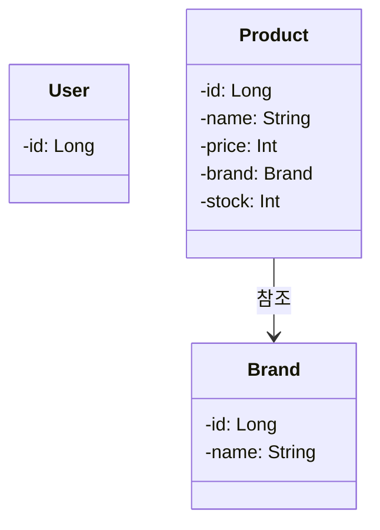
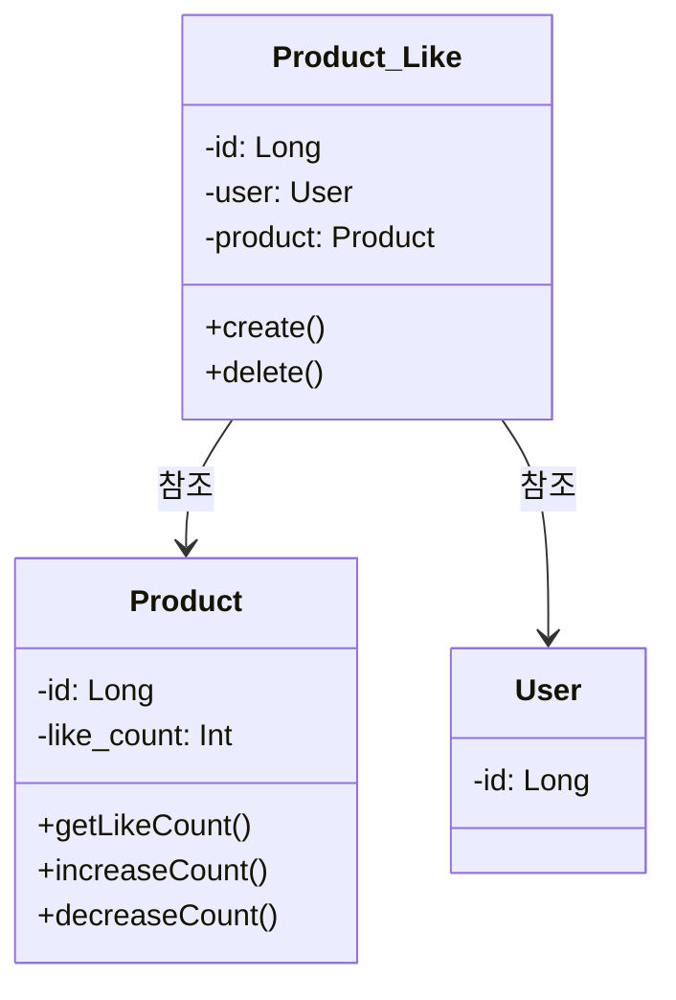
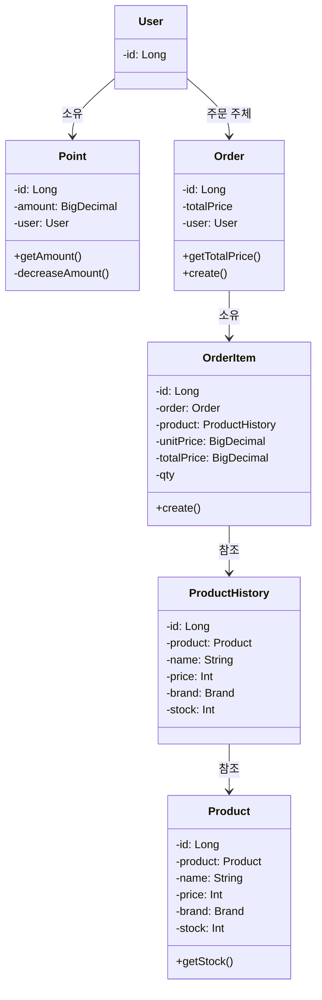

## 상품 목록, 상품 상세, 브랜드 조회

```mermaid 
classDiagram
    class User {
        -id: Long
    }

    class Product {
        -id: Long
        -name: String
        -price: Int
        -brand: Brand
        -stock: Int
    }

    class Brand {
        -id: Long
        -name: String
    }

    Product --> Brand : 참조
```

## 상품 좋아요 등록/취소

```mermaid 
classDiagram
    class User {
        -id: Long
    }

    class Product {
        -id: Long
        -like_count: Int
        +getLikeCount()
        +increaseCount()
        +decreaseCount()
    }

    class Product_Like {
        -id: Long
        -user: User
        -product: Product
        +create()
        +delete()
    }

    Product_Like --> Product : 참조 
    Product_Like --> User : 참조
```

6. 주문 생성 및 결제 흐름

```mermaid 
classDiagram
    class User {
        -id: Long
    }
    
    class Point {
        -id: Long
        -amount: BigDecimal
        -user: User
        +getAmount()
        -decreaseAmount()
    }

    class Order {
        -id: Long
        -totalPrice
        -user: User
        +getTotalPrice()
        +create()
    }

    class OrderItem {
        -id: Long
        -order: Order
        -product: ProductHistory
        -unitPrice: BigDecimal
        -totalPrice: BigDecimal
        -qty
        +create()
    }
    
    class ProductHistory {
        -id: Long
        -product: Product
        -name: String
        -price: Int
        -brand: Brand
        -stock: Int
    }
    
    class Product {
        -id: Long
        -product: Product
        -name: String
        -price: Int
        -brand: Brand
        -stock: Int
        +getStock()
    }
    
    User --> Order : 주문 주체  
    User --> Point : 소유
    Order --> OrderItem : 소유
    ProductHistory --> Product : 참조
    OrderItem --> ProductHistory : 참조
  
```