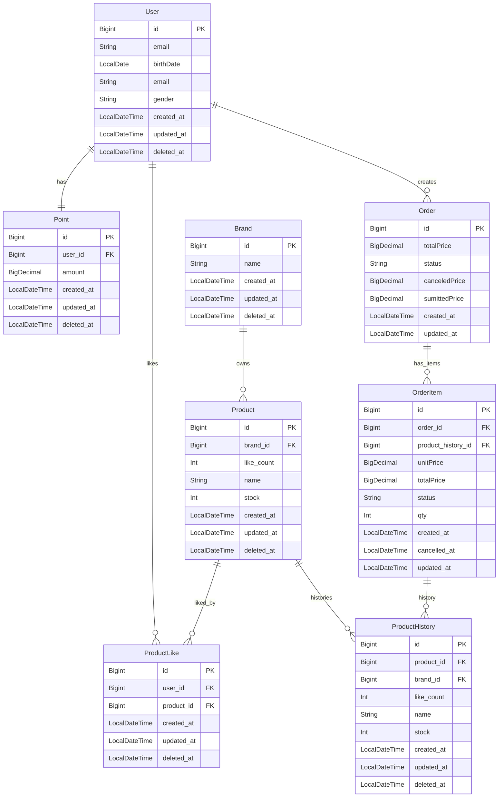

```mermaid 
erDiagram
    User {
        Bigint id PK
        String email
        LocalDate birthDate
        String email
        String gender
        
        LocalDateTime created_at 
        LocalDateTime updated_at 
        LocalDateTime deleted_at
    }
    
    Point {
        Bigint id PK
        Bigint user_id FK
        BigDecimal amount
        
        LocalDateTime created_at 
        LocalDateTime updated_at 
        LocalDateTime deleted_at 
    }
    
    Product {
        Bigint id PK
        Bigint brand_id FK
        Int like_count 
        String name
        Int stock
        
        LocalDateTime created_at 
        LocalDateTime updated_at 
        LocalDateTime deleted_at 
    }
    
    ProductHistory {
        Bigint id PK    
        Bigint product_id FK 
        Bigint brand_id FK
        Int like_count
        String name
        Int stock
        
        LocalDateTime created_at 
        LocalDateTime updated_at 
        LocalDateTime deleted_at 
    }
    
    ProductLike {
        Bigint id PK
        Bigint user_id FK
        Bigint product_id FK 
        
        LocalDateTime created_at 
        LocalDateTime updated_at 
        LocalDateTime deleted_at 
    }
    
    Brand {
        Bigint id PK
        String name
        
        LocalDateTime created_at 
        LocalDateTime updated_at 
        LocalDateTime deleted_at 
    }
    
    Order {
        Bigint id PK
        BigDecimal totalPrice
        String status
        BigDecimal canceledPrice
        BigDecimal sumittedPrice
        
        LocalDateTime created_at 
        LocalDateTime updated_at 
    }
    
    OrderItem {
        Bigint id PK
        Bigint order_id FK
        Bigint product_history_id FK
        BigDecimal unitPrice
        BigDecimal totalPrice
        String status
        Int qty
        
        LocalDateTime created_at 
        LocalDateTime cancelled_at 
        LocalDateTime updated_at 
    }
    
    %% 유저 관련
    User ||--|| Point : has
    User ||--o{ ProductLike : likes
    User ||--o{ Order : creates

    %% 상품 관련
    Product ||--o{ ProductLike : liked_by
    Product ||--o{ ProductHistory : histories

    %% 주문 관련
    Order ||--o{ OrderItem : has_items
    OrderItem ||--o{ ProductHistory : history

    %% 브랜드 관련
    Brand ||--o{ Product : owns

```